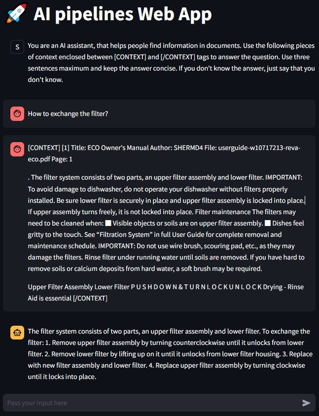
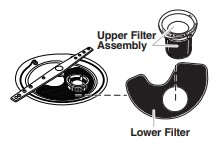

# Open-Source Software for AI Pipelines

Open-Source Software overview for building AI pipelines.

## Installation

Install requirements through `pip` and `llama-cpp-python`, which has to be installed separately because it has to be
build for CUDA acceleration (if applicable). The LlamaCpp package has to be installed as `llama-cpp-python[server]`, to
server the LLMs via an OpenAI-compatible REST API.

```bash
pip install -r requirements.txt

./llamacpp/install.sh
```

## Run

To start the LlamaCpp server:

```bash
cd llamacpp
./run.sh
```

Then, to run the Streamlit web app:
```bash
cd ..
./run_web_app.sh
```

The web app will be available under http://localhost:8000.

## Contents

### 1. Chat

Interact with the LLM through an chat interface. Provides support for message histiory and sessions. Is available both
in batch and streaming mode.

```
Chat with Mistral-7B-Instruct.
- type 'q' to quit
- type 'n' for a new session
Enter your prompt:

>  What is a derivative?
    A derivative is the rate of change of a function with respect to one of its variables. It can be calculated using
    calculus.
>  Can you explain in more detail?
    A derivative is a measure of how much the value of a function changes as one of its variables changes. It can be
    calculated using calculus by taking the limit of the difference quotient as the change in the variable approaches
    zero. The derivative can be used to find the maximum and minimum points of a function, as well as to solve
    differential equations.
>  How to calculate it for a quadratic function?
    To calculate the derivative of a quadratic function, you can use the power rule, which states that the derivative
    of x^n with respect to x is nx^(n-1). For example, the derivative of x^2 with respect to x is 2x, and the
    derivative of x^3 with respect to x is 3x^2.
>  n
Starting new session.

>  Explain to me what a gaussian distribution is.
    A Gaussian distribution, also known as a normal distribution, is a probability distribution that describes how data
    points are spread out around the mean value. It has a bell-shaped curve and is often used to model continuous data.
>  How to calculate its variance?
    The variance of a Gaussian distribution can be calculated by taking the average of the squared differences between
    each data point and the mean value. The formula for variance is:
    Variance = (1/n) * sum((x - mean)^2)
    where n is the number of data points, x is each data point, and mean is the mean value of the distribution.
>  q
```

### 2. Retrieval Augmented Generation (RAG)

Augment the knwledge of the LLM with text chunks, retrieved from the provided documents. Showceses how to split and
index the chunks in a vector database - Chroma, and build a RAG chain.

The LLM receives a context and the input query, which are formatted using a prompt template:

```
You are an AI assistant, that helps people find information in documents.
Use the following pieces of retrieved context to answer the question.
If you don't know the answer, just say that you don't know. Use three sentences maximum and keep the answer concise.

Question: {question} 

Context: {context} 

Answer:
```

The context is built from retrieved document chunks, which according to the cosine similarity score of embeddings, are
most relevant to the current query. The chunks are retrieved from the indexed vector store and properly formatted.
Finally, the the whole prompt is sent to the LLM to generate an answer.

Example with dishwasher manual:

```python
result = rag_chain_with_ref.invoke("What is the normal wash temperature?")
print(result["answer"])
print(result["documents"])
```

Result:

```
Answer:
The normal wash temperature is 105°F (41°C).
--------------------------------------------------------------------------------

[1] ECO Owner's Manual, Page 4, SHERMD4
Soak & Clean Increases main wash temperature from 105°F (41°C) to 130°F (54°C)
and final rinse from 140°F (60°C) to 155°F (68°C).

[2] ECO Owner's Manual, Page 3, SHERMD4
CYCLE GUIDE
Light to Medium
120
180
3.0 (11.4)
Heavy
150
210
```

### 3. Function Calling

The LLM extracts information from the input prompt and formats them into a prediefined JSON schema, which can be
injected into a function call. This is a very powerful method to leverage varius tools in AI pipelines and enhance LLM
abilities. Example use case: send emails:

```python
prompt = "Write an email to orders@carparts.com to place an order for new tyres for my Mercedes S-class"
# Response format: {"receiver": str, "topic": str, "content": str}
response = llm.invoke(prompt)
data = send_email(receiver=response["receiver"], topic=response["topic"], content=response["content"])
```

Output:

```
SENDING EMAIL

Receiver: 'orders@carparts.com'
Topic: 'Order for new tyres for Mercedes S-class'
--------------------------------------------------------------------------------

Dear Sir/Madam,

I am writing to place an order for new tyres for my Mercedes
S-class. I would like to purchase four tyres of the same size and brand as the
ones currently on my car. Please let me know the price and availability of the
tyres. I look forward to hearing from you soon.

Best regards,
Adam
```

### 4. AI-based Web App

Web app with chat interface that combines the previously discribed functionalities: chat history and RAG.



### 5. Multimodal Models

Multimodal Models are able to read images and gain knowledge from them. They combine text with visual data to produce
a powerful tool.

Describe the following image:



```python
base64_image = encode_image("./documents/image.jpg")
chat_llm.invoke([
    SystemMessage("You are an AI assistant, that helps people analyse images from manuals"),
    HumanMessage(
        content=[
            {
                "type": "image_url",
                "image_url": {"url": f"data:image/jpeg;base64,{base64_image}"}
            },
            {"type": "text", "text": "This an image from a dishwasher manual, describe it."}
        ]
    ),
])
```

Output:

```
The image is a diagram of a dishwasher's components. It shows the various parts of the dishwasher, including the upper
filter assembly and the lower filter. The diagram is labeled with the names of the components and their functions. The
upper filter assembly is located above the lower filter and is responsible for filtering out debris and dirt. The lower
filter is positioned below the upper filter and is designed to catch any remaining debris. The diagram provides a clear
visual representation of the dishwasher's internal structure and the role of each component in the cleaning process.
```